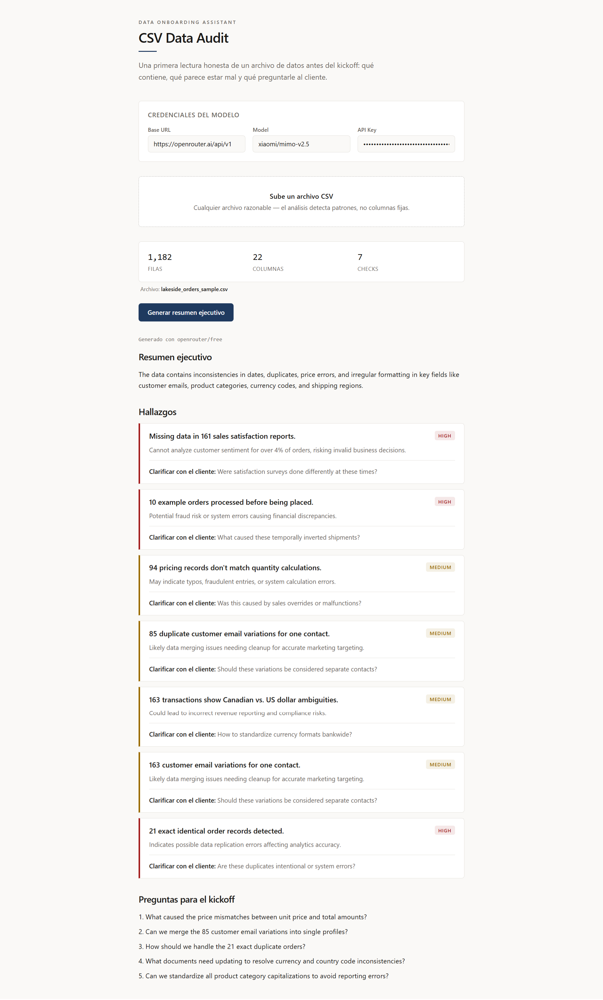

# CSV Data Audit — Data Onboarding Assistant

A React web app for consultants: drop in any CSV and get an honest first read before a client kickoff — what the data contains, what looks wrong, and what to ask the client. Built as the Keyrus AI Intern technical challenge.

The app runs **entirely in the browser**. No backend, no database, no deployment. The analysis engine is plain JavaScript; a single LLM call (by your own API key) translates the findings into plain language for a non-technical client.

## How it works

1. **Upload** — you drop a CSV in the browser (PapaParse reads it).
2. **Analyze** — 7 generic checks run in pure JS, none of them hardcoded to a specific schema:
   - Column completeness (missing values, including disguised blanks like `"n/a"`)
   - Mixed date formats (ISO, US, EU, epoch, month-name)
   - Temporal impossibilities (e.g. shipped before ordered)
   - Math reconciliation (does a "total" column match its factors?)
   - Duplicate rows and repeated record keys
   - Outliers (IQR)
   - Inconsistent casing / variants of the same value
3. **Summarize** — one LLM call turns the findings into an executive summary, per-finding consequences with severity, and 5 kickoff questions.
4. **Present** — a sober, editorial assessment UI (no table dump).

## Install & run

```bash
npm install
npm run dev
```

Open `http://localhost:5173`. That's it — no build step needed for local use.

## Model credentials

The app is provider-agnostic (OpenAI-compatible protocol). At the top of the page:

- **Base URL** — e.g. `https://openrouter.ai/api/v1` (also works with Groq, Ollama, Together, Gemini-compatible endpoints).
- **Model** — e.g. `openrouter/free`, `z-ai/glm-5.2:free`, or any paid model on your provider.
- **API Key** — yours. **Never committed**: the key lives only in React state, never touches disk, never reaches a server you control. A `.gitignore` blocks `.env` files and gitleaks scans every commit as a second layer.

If the configured model is rate-limited (429), the app automatically falls back to other models on the same base URL.

## Screenshot



## What doesn't work yet

- Free-tier OpenRouter models are rate-limited during peak hours (the app rotates to alternatives automatically; a key with credits is more reliable).
- Native Anthropic protocol (`/v1/messages`) is not implemented — Claude works via OpenRouter's compatible endpoint.
- Ambiguous date formats (e.g. `04/16/2024` vs `16/04/2024`) are parsed deterministically (US vs EU by separator); when a count depends on that choice the report says so explicitly.
- The math check picks the best matching formula among numeric columns; if a dataset uses an unusual formula (e.g. quantity × price × discount), rows may show as non-matching. It's reported honestly, not silently fixed.

## Project structure

```
├── README.md
├── NOTES.md
├── .gitignore
├── package.json
├── src/
│   ├── components/      # FileUpload, SettingsPanel
│   └── lib/             # analysis.js (engine), llm.js (one call)
├── skill/               # SKILL.md — reusable CSV data-quality audit skill
└── data/                # sample CSV (lakeside_orders_sample.csv)
```

## The skill

`skill/SKILL.md` is a reusable Claude skill encoding what this project had to correct three separate times: generic detection (no hardcoded columns), false positives from numeric parsers, and LLM JSON reliability. See `skill/SKILL.md` for install instructions.

## Notes for reviewers

- Commit history shows the work developed feature by feature.
- The engine was validated against the Lakeside sample in a pandas notebook first (see findings in NOTES.md), then translated 1:1 to JS.
- Tested with a second, unrelated CSV (test_ventas.csv) to prove the checks are generic.
